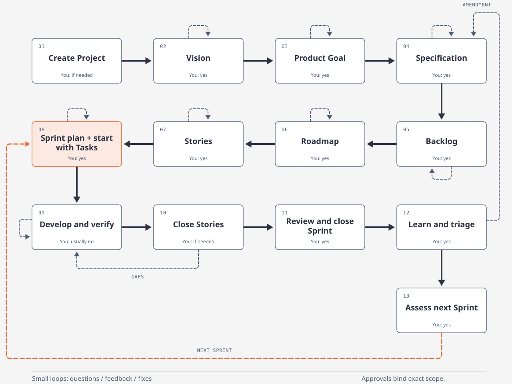

# AgileForge lifecycle

AgileForge keeps one durable Project through product planning, Sprint delivery,
and learning. This diagram shows the usual progression and its main feedback
loops. Each numbered stage can contain several commands and review decisions.

[Open the browser view](agileforge-lifecycle.html) locally for hover descriptions.
The [SVG](assets/agileforge-lifecycle.svg) is the shared diagram source used by
the README and browser view. A more detailed
[Mermaid outline](../scrum_agentic_system_lifecycle.mmd) separates the transitions.

## Stages and decisions

| Stage | Input and result | Human involvement |
| --- | --- | --- |
| 1. Create Project | Product identity and repository binding establish the durable Project. | Supply missing setup details; an existing instruction to create it is sufficient authority. |
| 2. Vision | Project and repository evidence feed bootstrap/interview work and review of the product direction. | Clarify direction and review the exact candidate. |
| 3. Product Goal | The accepted Vision anchors a measurable outcome and success criteria. | Answer product questions and review the Goal. |
| 4. Specification | Register exact prepared source bytes; structure a canonical `agileforge.spec.v2` candidate; review it. | Approve source content and the exact structured candidate. |
| 5. Backlog | The accepted Specification constrains generated product work items. | Review scope and product value. |
| 6. Roadmap | Accepted Backlog items feed the proposed sequence of work. | Review priorities and tradeoffs. |
| 7. Stories | Backlog and Roadmap feed Story candidates and acceptance criteria. | Review expected behavior and resolve human-owned readiness inputs. |
| 8. Sprint plan and start | Select eligible Stories, establish sizing/rank, structural evidence and dependency review, generate Tasks in a plan, review it, and start the Sprint. | Choose scope and capacity, confirm dependencies, and approve the plan/start. |
| 9. Develop and verify | Execute the current Task in the target repository, verify its checklist and Story criteria, then record completion evidence. | Usually unnecessary within authorized scope; resolve new product or scope decisions when needed. |
| 10. Close Stories | Terminal Tasks and exact evidence support a separate Story closure with delivered results and known gaps. | Confirm closure when not already authorized; do not equate a ready-to-close route with full product acceptance. |
| 11. Review and close Sprint | Review the terminal Story set, then close the Sprint against its persisted review. | Assess the result and authorize review/closure. |
| 12. Learn and triage | Record learning and impact for that closed Sprint. | Decide the impact and intended follow-up. |
| 13. Assess next Sprint | Reuse valid accepted planning or address required revisions under the same Project. | Choose continuation and the next scope when appropriate. |

Existing authorization remains valid for the action and scope it covers. It does
not accept a revised candidate or authorize unrelated provider calls. Provider
work and human decisions follow the
[AgileForge skill](../.agents/skills/using-agileforge/SKILL.md).

## What the arrows mean

**Solid arrows show the usual order, not every graph edge.** Specification
registration, structuring, and review are separate transitions, as are Sprint
review, closure, and triage. Task execution and Story closure can interleave:
a Story may become ready to close while other Stories still have work.

**Small planning loops represent questions, feedback, and revision.** Each stage
uses its own supported actions. A prior candidate's acceptance does not approve
new content. Accepted artifacts and their lineage remain historical evidence.
Discovery and external specification preparation are not additional persisted
workflow gates.

**The development loop represents work before completion.** Build, test, review,
and fix within the active Task/Story contract. Report remaining gaps honestly.
The arrow back from Story closure does not provide a general command to reopen
a completed Task or replace its recorded evidence.

**The next-Sprint loop is conditional.** Triage records learning; it does not
automatically apply a Backlog correction, amend requirements, or start a Sprint.
The same Project can continue with eligible remaining Stories and valid accepted
planning. Story selection, readiness, and dependencies still gate the next plan.

**Changed requirements may return to Specification.** The implemented source
amendment route requires a completed Sprint later than the accepted Specification
and its candidate, with no active Sprint/retry or unresolved review/triage work.
Register the revised source through the eligible route, structure it, and review
the new candidate. Downstream work must satisfy the resulting current lineage.
Recording triage with `impact=specification` alone does not perform an amendment.

The picture omits other branches, including Backlog/Story corrections, optional
Goal outcomes and Vision revision, and Sprint retry. These are not automatic
consequences of reaching stage 13. A Sprint retry preserves the original
completed attempt and requires fresh evidence for the new attempt.

## Use the live route

Read both `workflow position` and `workflow next` using the selected runtime and
Project before a mutation and after its successful result. The graph can report
waiting, blocked, invalid, or recovery states that the overview does not draw.
Execute the current advertised template under the user's authority. If a desired
continuation is not exposed, investigate that state rather than guessing a
command from the diagram. See the [CLI manual](agent-cli-manual.md).

## Implementation references

This overview was checked against the repository implementation on 2026-09-12.
It describes the lifecycle, not the live position of a particular Project.

- [Root graph](../workflow/definitions/root.py) groups Vision, Goal,
  Specification, Backlog, planning, and execution.
- [Specification rules](../workflow/definitions/product_discovery.py) separate
  registration, structuring, review, source revision, and amendment eligibility.
- [Planning rules](../workflow/definitions/planning.py) gate Roadmap, Stories,
  dependency/readiness checks, and Sprint planning/start.
- [Execution rules](../workflow/definitions/execution.py) separate Task evidence,
  Story closure, Sprint review, Sprint closure, triage, and retry.
- [Goal rules](../workflow/definitions/product_goal.py) define lifecycle
  quiescence and optional Goal outcomes.
- [CLI routing](../cli/workflow_commands.py) exposes executable templates and
  supported optional re-entry; the overview does not replace that filtering.
