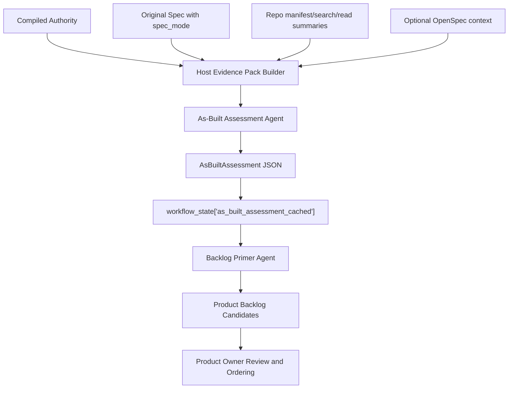

# As-Built Assessment Agent Design

**Date:** 2026-05-28
**Status:** Draft for review
**Scope:** Brownfield pre-backlog implementation-state assessment

## Summary

AgileForge needs a reliable pre-backlog step for brownfield projects. The caRtola
trial showed that an accepted technical spec can describe behavior that is
already present in the repository, but AgileForge may still generate backlog
work as if the project were greenfield.

The missing artifact is an `AsBuiltAssessment`: a structured, agent-authored
assessment of what the repository appears to implement today, compared against
accepted product authority. This artifact is advisory input to backlog
generation. It is not the Product Backlog, not sprint work, and not proof that a
capability is complete without evidence.

Phase 1 uses a host-prepared evidence pack. The assessment agent receives bounded
context and produces structured output. It does not call repo tools, CodeGraph,
OpenSpec commands, test runners, or arbitrary shell commands during its own run.

## Problem Statement

AgileForge lacks a reliable pre-backlog implementation-state extraction step for
brownfield projects. It can compile accepted product authority, but it cannot yet
map that authority to current repository evidence before backlog generation. As
a result, generated backlog items may ignore existing implementation, misclassify
gaps, or duplicate completed work.

## Goals

- Produce an inspectable artifact that describes current observed implementation
  state before backlog generation.
- Preserve the distinction between product intent, spec context, and
  implementation evidence.
- Allow backlog generation to distinguish new work from verification,
  hardening, contradiction, unknowns, and already-observed behavior.
- Keep Phase 1 bounded, replayable, and debuggable by using a host-prepared
  evidence pack rather than open-ended agent tool use.
- Fit the existing AgileForge Google ADK agent pattern: `agent.py`,
  `schemes.py`, `instructions.txt`, and a theory/reference document.

## Non-Goals

- No automatic Product Backlog mutation from the assessment.
- No Sprint Planning changes in Phase 1.
- No OpenSpec command execution.
- No `/opsx:apply`, `/opsx:sync`, or `/opsx:archive` integration.
- No agent-side arbitrary shell access.
- No CodeGraph integration in Phase 1.
- No claim that absence of evidence means implementation is missing.
- No replacement for Product Owner backlog review and ordering.

## Source Roles

The agent must treat each input according to its role:

| Source | Role | Authority |
| --- | --- | --- |
| `compiled_authority` | Product obligations and invariants | Defines intended behavior |
| Original spec | Context, vocabulary, examples, and `spec_mode` | Explains intent; not proof |
| Host-prepared repo evidence pack | Candidate proof of current implementation | Supports current-state claims |
| Optional OpenSpec files | Additional current/proposed behavior context | Advisory only in Phase 1 |

Rules:

- A spec describing current behavior is not backlog scope.
- A spec describing desired behavior is not proof that work is missing.
- Repo evidence is required for `observed` claims.
- Missing repo evidence is `not_observed` or `unclear`, not proof of absence.

## Phase 1 Architecture



The host prepares the evidence pack using bounded deterministic collection:
file manifests, selected source/test/doc snippets, existing spec artifacts, and
small summaries. The agent reasons over this bounded packet and returns
structured JSON.

## Agent Folder Shape

Phase 1 should follow existing agent-tool conventions:

```text
orchestrator_agent/agent_tools/as_built_assessor/
  agent.py
  schemes.py
  instructions.txt
  scrum_theory_as_built_assessor.md
```

`agent.py` should use the same Google ADK `Agent` + `LiteLlm` pattern used by
existing tools such as `roadmap_builder`.

## Input Schema

Phase 1 implementation must define exact Pydantic models with
`model_config = ConfigDict(extra="forbid")` for agent output and for host-side
cache envelopes. Input models may use `extra="ignore"` only where existing agent
runtime context can add unrelated keys.

Draft agent input shape:

```json
{
  "project_id": 2,
  "assessment_id": "as-built-...",
  "compiled_authority": "{...}",
  "original_spec": {
    "spec_mode": "current_state | desired_state | proposed_change | unknown",
    "json": "{...}",
    "markdown": "..."
  },
  "repo_evidence_pack": {
    "schema_version": "agileforge.as_built_evidence_pack.v1",
    "builder_version": "agileforge.as_built_pack_builder.v1",
    "authority_fingerprint": "sha256:...",
    "evidence_pack_fingerprint": "sha256:...",
    "generated_at": "2026-05-28T12:00:00Z",
    "repo_path": "/path/to/repo",
    "git_commit": "abc123",
    "dirty": false,
    "warnings": [],
    "file_manifest_summary": {},
    "authority_targets": [],
    "source_snippets": [],
    "test_snippets": [],
    "doc_snippets": [],
    "cli_observations": [],
    "search_observations": []
  },
  "openspec_context": {
    "present": false,
    "spec_summaries": [],
    "change_summaries": []
  },
  "prior_as_built_assessment": "NO_HISTORY",
  "user_input": ""
}
```

The implementation plan may refine field names for consistency with local
schema conventions, but it must preserve the required metadata, enum semantics,
and bounded-input contract in this section. If the host does not have a source
type, it passes an empty list or `"NO_HISTORY"` instead of letting the agent
fetch it.

### `spec_mode` Provenance

`spec_mode` is required in the agent input. The host resolves it in this order:

1. explicit workflow/spec metadata when available
2. a user-provided mode override
3. `"unknown"`

When `spec_mode` is `"unknown"`, the agent must include a limitation explaining
that current behavior, desired behavior, and proposed changes may be mixed. It
must not infer backlog scope from the spec alone.

## Output Schema

Draft shape:

```json
{
  "schema_version": "agileforge.as_built_assessment.v1",
  "project_id": 2,
  "assessment_id": "as-built-...",
  "agent_version": "agileforge.as_built_assessor.v1",
  "evidence_pack_builder_version": "agileforge.as_built_pack_builder.v1",
  "authority_fingerprint": "sha256:...",
  "evidence_pack_fingerprint": "sha256:...",
  "generated_at": "2026-05-28T12:00:00Z",
  "assessment_summary": "...",
  "repo_snapshot": {
    "path": "/path/to/repo",
    "git_commit": "abc123",
    "dirty": false
  },
  "capability_assessments": [
    {
      "authority_ref": "REQ.live-squad-recommendation",
      "invariant_refs": ["INV-a4b296c058e88663"],
      "capability_title": "Live squad recommendation",
      "status": "observed",
      "confidence": "medium",
      "evidence": [
        {
          "kind": "source",
          "path": "scripts/run_live_round.py",
          "summary": "Contains live recommendation orchestration.",
          "supports": "The repository appears to run a live recommendation flow."
        }
      ],
      "limitations": ["Tests were not executed."],
      "recommended_backlog_treatment": "skip_new_implementation",
      "reasoning": "..."
    }
  ],
  "cross_cutting_findings": [],
  "open_questions": [],
  "is_complete": true,
  "clarifying_questions": []
}
```

`is_complete` is `true` only when the agent has produced one assessment for
every host-provided `authority_targets` entry, all enum fields are valid, and no
required schema fields are empty. It may still be `true` when many statuses are
`unclear`; completeness means the assessment pass finished, not that evidence is
strong. If required input is missing, schema content is inconsistent, or target
coverage is incomplete, `is_complete` must be `false` with clarifying questions
or limitations. An empty `authority_targets` list is complete only when the
evidence pack includes an explicit no-targets limitation; otherwise it is an
incomplete assessment input.

### Assessment Statuses

- `observed`: repo evidence supports that the behavior appears implemented.
- `observed_with_missing_evidence`: implementation appears present, but tests,
  docs, or validation evidence are missing.
- `contradicted`: repo evidence appears to conflict with accepted authority.
- `not_observed`: bounded evidence did not find support for the behavior.
- `unclear`: evidence is insufficient, ambiguous, or conflicting.

`not_observed` must not be described as “missing implementation” unless the
evidence pack includes a strong reason to make that claim.

### Confidence

- `high`: multiple independent evidence types support the assessment, or
  deterministic validation output is included.
- `medium`: one strong source/test/doc/CLI evidence path supports the assessment.
- `low`: evidence is weak, indirect, absent, or ambiguous.

Phase 1 should expect mostly `medium` and `low` confidence because tests are not
necessarily executed.

### Recommended Backlog Treatment

Allowed values:

- `skip_new_implementation`
- `create_verification_item`
- `create_hardening_item`
- `create_authority_conflict_item`
- `create_discovery_item`
- `create_product_item`
- `po_review_required`

These are recommendations only. The Product Owner still decides whether a
Product Backlog item exists and how it is ordered.

## Evidence Pack Builder

The evidence pack builder is host-side deterministic code. It may use bounded
file listing, bounded text search, bounded file reads, and existing workflow
state. Phase 1 should avoid semantic code analysis and avoid agent-side repo
tools.

The pack should include:

- repo identity: path, git commit, dirty flag
- source/test/doc/config file manifest summaries
- authority targets derived from accepted compiled authority
- snippets selected by invariant IDs, invariant types, behavioral parameters,
  source-map excerpts, structured profile item IDs, and normalized domain nouns
- original spec content or summaries
- compiled authority JSON
- warnings about skipped files, oversized files, unreadable files, and dirty
  state

The builder does not classify implementation state. It prepares evidence for the
agent to assess.

### Authority Target Extraction Contract

The host evidence pack builder must not assume `compiled_authority.items[]`
exists. Real AgileForge authority artifacts may be invariant/source-map shaped.
Target extraction must inspect, in order:

1. `compiled_authority.invariants[]`
   - target id: invariant `id`, such as `INV-a4b296c058e88663`
   - target type: invariant `type`, such as `DATA_CONTRACT`
   - source requirement: `parameters.source_item_id` when present
   - behavioral terms: stable strings from `parameters`
2. `compiled_authority.source_map[]`
   - source item ids, excerpts, and relationships that explain where invariants
     came from
3. structured profile items when available
   - `REQ.*`, `QUALITY.*`, `CONSTRAINT.*`, `INTERFACE.*`, and `DATA.*`
4. normalized domain nouns from accepted spec statements and invariant
   parameters

For caRtola-like artifacts with `invariants[]` and no useful `items[]`, the
builder must still produce non-empty `authority_targets`. A Phase 1 acceptance
test must cover this shape.

### Evidence Pack Budgets

Phase 1 must enforce concrete caps before calling the agent:

- maximum authority targets: 150
- maximum snippets per target: 5
- maximum snippet size: 40 lines or 8 KiB, whichever is smaller
- maximum full evidence pack JSON size: 750 KiB
- maximum file manifest entries included verbatim: 300

Skipped or truncated content must be represented as warnings in the evidence
pack. Warnings must include path, reason, and count fields where applicable.

### Cache Metadata And Invalidation

The cached assessment must include enough metadata to detect stale reuse:

- `schema_version`
- `agent_version`
- `evidence_pack_builder_version`
- `authority_fingerprint`
- `repo_git_commit`
- `repo_dirty`
- `evidence_pack_fingerprint`
- `generated_at`

The assessment is stale when the accepted authority fingerprint, repo commit,
dirty flag, evidence-pack builder version, or evidence-pack fingerprint differs
from the cached assessment metadata. Stale assessments must not be silently
passed into backlog generation.

## Backlog Integration

Backlog generation must receive the cached assessment as advisory context through
a first-class Backlog Primer input field:

```text
as_built_assessment
```

`build_backlog_input_context` must serialize
`workflow_state["as_built_assessment_cached"]` into
`InputSchema.as_built_assessment`, or pass `"NO_AS_BUILT_ASSESSMENT"` when no
fresh assessment is available. Tests must fail if the field is omitted.

The existing `implementation_evidence` field and
`implementation_evidence_cached` are retained only for compatibility with the
Phase 1a deterministic collector. The new `as_built_assessment` field supersedes
it for brownfield backlog generation. If both are present, backlog instructions
must treat `as_built_assessment` as the richer advisory source and may treat
`implementation_evidence` as a low-level supporting signal.

Backlog generation must use the assessment conservatively:

- `observed` should suppress duplicate implementation work unless the PO asks
  for replacement or redesign.
- `observed_with_missing_evidence` should become verification or hardening work,
  not new implementation.
- `contradicted` should become a PO-visible conflict finding.
- `not_observed` may produce `create_product_item` only when accepted authority
  requires the capability and no stronger `unclear` or `contradicted` evidence
  exists.
- `unclear` should become discovery or PO review, not guessed implementation.

### Backlog Adapter Contract

The Backlog Primer input schema must add:

```python
as_built_assessment: str
```

The field contains raw canonical `agileforge.as_built_assessment.v1` JSON or the
literal `"NO_AS_BUILT_ASSESSMENT"`.

Required backlog instruction mapping:

| Assessment status | Recommended treatment | Backlog behavior |
| --- | --- | --- |
| `observed` | `skip_new_implementation` | Do not create duplicate implementation work; mention only as context if needed. |
| `observed_with_missing_evidence` | `create_verification_item` or `create_hardening_item` | Scope work to tests, validation, docs, or hardening. |
| `contradicted` | `create_authority_conflict_item` | Create PO-visible conflict/remediation candidate. |
| `not_observed` | `create_product_item` or `po_review_required` | Create product work only with confidence and evidence limitations visible. |
| `unclear` | `create_discovery_item` or `po_review_required` | Create discovery/review item, not implementation by guess. |

Required tests:

- `build_backlog_input_context` passes cached `as_built_assessment_cached` into
  `as_built_assessment`.
- missing cache becomes `"NO_AS_BUILT_ASSESSMENT"`.
- Backlog Primer schema accepts the new field.
- Backlog instructions include mappings for `observed`, `contradicted`,
  `not_observed`, and `unclear`.
- A caRtola-shaped assessment with `observed` capability does not produce a
  duplicate implementation backlog item in the brownfield smoke path.

## OpenSpec Role

OpenSpec is optional in Phase 1. If present, OpenSpec specs and changes may be
included in the evidence pack as context. They are not implementation evidence
unless paired with repo/test/CLI observations.

OpenSpec should not replace AgileForge backlog generation, PO ordering, Sprint
Planning, or Sprint execution tickets.

## Risks

- The agent may overstate implementation from weak evidence.
- The evidence pack may omit the files needed for a correct assessment.
- The assessment may become too verbose for backlog generation.
- Current-state specs may again be mistaken for future backlog scope if
  `spec_mode` is missing or ignored.
- Dirty repos may produce unstable assessments.
- Optional OpenSpec context may be stale.

## Phase 1 Acceptance Criteria

- A new design-approved agent contract exists for `as_built_assessor`.
- The agent output is structured and schema-validated.
- The agent can produce an `AsBuiltAssessment` from bounded input without
  calling repo tools.
- Brownfield backlog generation can receive the assessment as advisory context.
- caRtola smoke can produce non-empty capability assessments or explicit
  `unclear` findings with evidence limitations.
- The assessment command does not mutate persisted Product Backlog rows; later
  backlog draft generation may use it only as advisory input for PO-reviewed
  candidates.

## Deferred

- CodeGraph tools inside the agent.
- Interactive agent-side repo search/read loops.
- Persistent assessment ledger.
- OpenSpec import/export/sync/archive automation.
- Test execution and validation-result ingestion.
- Semantic code-to-authority mapping beyond bounded evidence and agent
  reasoning.
