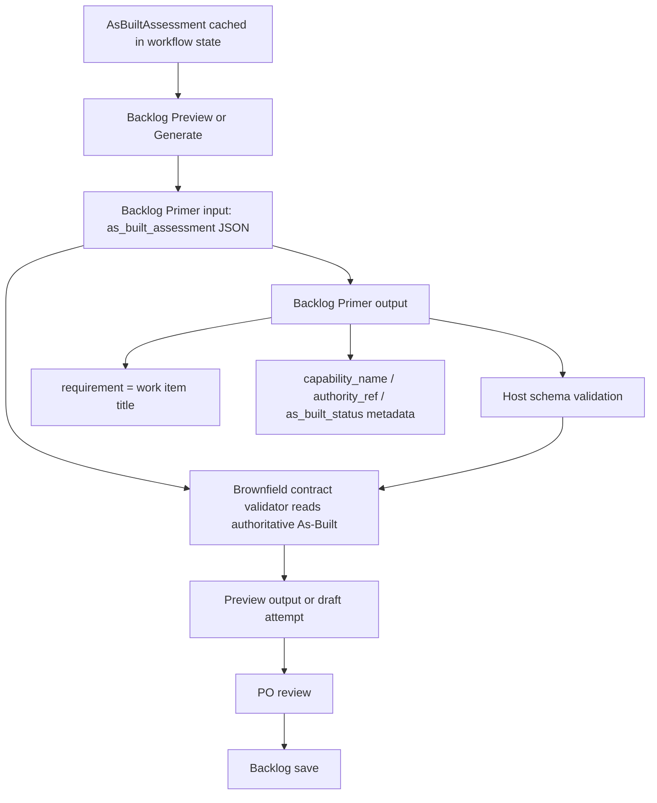

# Brownfield Backlog Item Contract Design

**Date:** 2026-05-30
**Status:** Accepted
**Spec mode:** proposed_change
**Scope:** Backlog Primer output contract for brownfield-aware Product Backlog previews and saves

## Summary

AgileForge now has a working As-Built Assessment path for brownfield projects.
The caRtola smoke proved that `agileforge as-built assess` can cache a
115-capability implementation assessment and that `agileforge backlog preview`
can consume that cache without mutating backlog history.

The remaining problem is not only wording. The Backlog Primer currently uses one
field, `requirement`, as both capability identity and work item title. In
brownfield projects those are different concepts. A capability can already exist
while the remaining Product Backlog Item is verification, hardening, evidence,
documentation, or conflict resolution.

This design adds a small structured brownfield contract to Backlog Primer output
while keeping the existing downstream field `requirement` as the compatibility
work item title.

## Problem Statement

In caRtola, backlog preview consumed As-Built context and improved item scope,
but several item titles still read as greenfield implementation:

- `Live Pre-Lock Squad Recommendation Workflow Core`
- `Captain-Aware Squad Optimizer`
- `Moving-Budget Backtest Engine Hardening`
- `Roster Legality & Budget Constraint Validation Contract`
- `Leakage-Safe Pre-Lock Evidence Guard & Market Capture`

Their bodies described verification or hardening of existing behavior, but the
titles often named the capability rather than the work remaining. Downstream
agents and humans scan titles first. If a title names only the capability, later
story, sprint, or execution agents can misread the item as "build this from
scratch."

## Goals

- Separate capability identity from remaining backlog work in Backlog Primer
  output.
- Preserve compatibility with existing backlog, roadmap, story, and sprint
  flows.
- Make brownfield title/status alignment enforceable by host-side validation,
  not prompt text alone.
- Keep the first implementation slice schema-local and migration-free.
- Preserve AgileForge authority boundaries: As-Built is advisory evidence;
  AgileForge remains Product Backlog and Scrum workflow authority.
- Keep `backlog preview` non-mutating and suitable for brownfield quality smoke
  tests from completed project states.

## Non-Goals

- No database migration in the first slice.
- No new DB tables.
- No global `backlog save` block in the first slice.
- No automatic greenfield/brownfield detector in the first slice.
- No OpenSpec integration.
- No change to sprint planning, story refinement, or task execution schemas in
  the first slice.
- No rename of `requirement` to `work_item_title` in the first slice.

## Current Behavior

`BacklogItem.requirement` is currently described as a high-level requirement or
capability. It becomes the saved `UserStory.title`. It also flows into roadmap
and story-generation context as the visible backlog item identity.

That works for greenfield or pure desired-state planning, but it is ambiguous in
brownfield planning:

| Concept | Example | Meaning |
| --- | --- | --- |
| Capability identity | `Captain-Aware Squad Optimizer` | Product behavior being assessed |
| Work item title | `Validate Captain-Aware Optimizer Contract` | Remaining backlog work now |

The first concept should remain trace metadata. The second concept should be the
PBI title.

## Proposed Contract

### Field Semantics

Backlog Primer output keeps `requirement`, but its meaning becomes:

```text
requirement = work item title: concise action-oriented title for remaining work
```

Backlog Primer output adds optional brownfield metadata:

```text
capability_name = product capability being assessed
authority_ref = accepted authority/spec reference when known
as_built_status = status copied from AsBuiltAssessment
recommended_backlog_treatment = treatment copied or derived from AsBuiltAssessment
```

For As-Built-backed items, `authority_ref`, `as_built_status`, and
`recommended_backlog_treatment` are not model-owned assertions. They must match
the authoritative `capability_assessments[]` entry from the Backlog Primer input
context. `capability_name` must match the As-Built `capability_title` after
normalization, unless a later explicit alias contract is added.

Example:

```json
{
  "priority": 1,
  "requirement": "Validate Captain-Aware Optimizer Contract",
  "capability_name": "Captain-Aware Squad Optimizer",
  "authority_ref": "REQ.captain-aware-optimization",
  "as_built_status": "observed_with_missing_evidence",
  "recommended_backlog_treatment": "create_verification_item",
  "value_driver": "Strategic",
  "justification": "As-Built evidence indicates the optimizer exists or likely exists, but its captain multiplier and policy outputs need auditable validation.",
  "estimated_effort": "M",
  "technical_note": "Use existing optimizer and output artifacts as evidence sources; do not rebuild optimizer logic unless validation reveals a gap."
}
```

### Status-To-Title Rules

When `as_built_status` is present, `requirement` must describe the remaining
work implied by that status.

| `as_built_status` | Allowed title intent | Disallowed title intent |
| --- | --- | --- |
| `observed` | `Verify`, `Document`, `Monitor`, `Preserve` | `Build`, `Implement`, `Create` |
| `observed_with_missing_evidence` | `Verify`, `Harden`, `Validate`, `Formalize`, `Add Evidence For` | plain capability noun, `Build`, `Implement`, `Create` |
| `contradicted` | `Resolve`, `Align`, `Correct` | `Build`, plain capability noun |
| `not_observed` | `Build`, `Add`, `Implement`, `Create` allowed | none beyond normal backlog quality rules |
| `unclear` | `Discover`, `Investigate`, `Clarify` | `Build`, `Implement`, `Create` |

If a brownfield item intentionally needs rebuild work despite `observed` or
`observed_with_missing_evidence`, the item must state that rationale in
`technical_note`. The first slice may reject this case until an explicit override
contract exists.

### Treatment Rules

`recommended_backlog_treatment` should use the As-Built treatment vocabulary
when available:

- `skip_new_implementation`
- `create_verification_item`
- `create_hardening_item`
- `create_authority_conflict_item`
- `create_discovery_item`
- `create_product_item`
- `po_review_required`

Backlog Primer may omit an item entirely for `observed` +
`skip_new_implementation` unless PO input asks for documentation, monitoring, or
preservation work.

### Completeness Rule

The current "10+ items" rule is greenfield-biased. Brownfield completeness must
not force fake work just to reach a count. In this first design, the generated
artifact may remain incomplete when the agent asks clarifying questions, but the
quality bar should shift toward:

- all high-priority unresolved authority gaps are represented or explicitly
  skipped;
- observed capabilities are not duplicated as build work;
- verification/hardening items cite the capability they are validating;
- clarifying questions are explicit when prioritization or scope remains unclear.

A later design should replace the fixed item-count rule with an authority
coverage and PO-readiness rule.

## Validation

Prompt guidance alone is insufficient. Host-side validation must run after
Backlog Primer output schema validation.

The validator must receive both the parsed output and the input context:

```python
_validate_brownfield_contract(
    *,
    output_model: OutputSchema,
    input_context: BacklogInputContext,
) -> None
```

The validator must parse `input_context["as_built_assessment"]` when it is not
`NO_AS_BUILT_ASSESSMENT`. It must inspect `capability_assessments[]` and build
an authoritative lookup keyed by:

- exact `authority_ref`;
- normalized `authority_ref`;
- normalized `capability_title`.

Normalization is for comparison only. It should trim whitespace, collapse
internal whitespace, lowercase, and remove non-semantic punctuation that does
not distinguish AgileForge IDs or titles. It must not silently rewrite output.

When a backlog item maps to an assessed capability by `authority_ref` or by
normalized `capability_name` / `capability_title`, the item must include:

- `capability_name`;
- `authority_ref`;
- `as_built_status`;
- `recommended_backlog_treatment`.

The item-side match candidates are exactly:

- `BacklogItem.authority_ref`;
- `BacklogItem.capability_name`;
- `BacklogItem.requirement`.

A backlog item maps to an assessed capability when any item-side match candidate
matches an As-Built `authority_ref` or `capability_title` after normalization.
This means a legacy-looking item such as
`requirement: "Captain-Aware Squad Optimizer"` must be recognized as mapped to
the As-Built capability titled `Captain-Aware Squad Optimizer`, even when the
model omitted all brownfield metadata.

The validator must reject omitted or mismatched As-Built metadata:

- missing `as_built_status`;
- wrong `as_built_status`;
- wrong `recommended_backlog_treatment`;
- missing or wrong `authority_ref`;
- missing `capability_name`;
- `capability_name` that does not normalize to the matched As-Built
  `capability_title`.

This comparison is the core contract. Without it, the Backlog Primer can omit or
invent brownfield metadata and still pass output-only validation.

### Title Allowlist

Validation accepts:

- greenfield or unmatched items with no `as_built_status`;
- `not_observed` items titled as build/add/implement work;
- `observed_with_missing_evidence` items titled as verify/harden/validate/
  formalize/evidence work;
- `unclear` items titled as discover/investigate/clarify work;
- `contradicted` items titled as resolve/align/correct work.

The title check must be a normalized allowlist per status, not only a denylist:

| `as_built_status` | Required normalized title prefix |
| --- | --- |
| `observed` | `Verify`, `Document`, `Monitor`, or `Preserve` |
| `observed_with_missing_evidence` | `Verify`, `Validate`, `Harden`, `Formalize`, or `Add Evidence For` |
| `contradicted` | `Resolve`, `Align`, or `Correct` |
| `unclear` | `Discover`, `Investigate`, or `Clarify` |
| `not_observed` | `Build`, `Add`, `Implement`, or `Create` may be allowed |

Validation rejects:

- brownfield items where `requirement` equals `capability_name`;
- `observed` items whose title does not start with an allowed `observed`
  prefix;
- `observed_with_missing_evidence` items whose title does not start with an
  allowed `observed_with_missing_evidence` prefix;
- `contradicted` items whose title does not start with an allowed
  `contradicted` prefix;
- `unclear` items titled as implementation work;
- missing `capability_name` when `as_built_status` is present;
- unknown `as_built_status` values.

Validation should return failure artifacts through the existing Backlog runtime
failure path with `failure_stage="brownfield_contract_validation"`. It should
not silently rewrite item titles.

## Roadmap Compatibility

Roadmap Builder currently validates backlog items with `extra="forbid"`. Adding
fields only to Backlog Primer can break roadmap generation.

Preferred first-slice behavior:

- add the same optional brownfield metadata fields to Roadmap Builder's
  `BacklogItem` schema; or
- explicitly strip metadata before roadmap input and document that roadmap does
  not yet consume brownfield metadata.

Recommendation: add optional metadata to Roadmap Builder. It preserves context
inside roadmap artifacts without requiring database changes. It does not mean
story, sprint, or task agents consume that metadata yet; downstream consumption
remains a later slice.

## Save Behavior

No save gate is required in the first slice. Existing `backlog save` guards
remain unchanged:

- reviewed attempt id;
- artifact fingerprint;
- expected state;
- idempotency key;
- complete artifact;
- no clarifying questions.

Later, AgileForge should add a conditional save-time gate:

```text
If a project/spec is brownfield, mixed, current_state, or unknown with As-Built
available, backlog save requires that the reviewed attempt consumed a fresh
As-Built assessment.
```

That gate is deferred because it needs a stable `requires_as_built` or
`spec_mode` source and migration behavior for legacy projects.

Persisting brownfield metadata into the saved story description is acceptable as
a human-visible annotation, but it does not fully transmit As-Built context to
downstream agents in the current repo. Story generation currently builds input
from roadmap and workflow state context, not from a saved backlog seed
`story_description`. Downstream propagation of `capability_name`,
`authority_ref`, `as_built_status`, and `recommended_backlog_treatment` into
story refinement and sprint planning is a later slice.

## Data Flow



## Backward Compatibility

- Existing backlog items without brownfield metadata remain valid.
- Existing greenfield generation can continue with `capability_name = null` and
  `as_built_status = null`.
- `requirement` remains the title consumed by existing downstream code.
- No DB migration is required in the first slice.
- Legacy caRtola backlog/stories/sprint artifacts remain historical output from
  the pre-As-Built path and should not be rewritten by this change.

## Alternatives Considered

### Prompt-Only Rule

Rejected as first-class fix. It can improve output but cannot enforce the
contract. A model can still output a capability-noun title for observed behavior
and pass the current schema.

### Add `work_item_title` As A New Required Field

Rejected for the first slice. It creates two title fields and requires immediate
downstream migration. Keeping `requirement` as the compatibility work item title
is safer.

### Add DB Columns Now

Rejected for the first slice. The preview smoke can prove the schema/prompt/
validator behavior before persistence changes.

### Save-Time As-Built Gate Now

Deferred. Valuable, but it needs a separate design for freshness, greenfield
exemptions, `spec_mode`, and legacy project handling.

## Acceptance Criteria

- Backlog Primer schema accepts optional `capability_name`, `authority_ref`,
  `as_built_status`, and `recommended_backlog_treatment`.
- Backlog Primer prompt states that `requirement` is the work item title.
- Backlog Primer prompt states that `capability_name` is the product capability.
- Host validation rejects an `observed_with_missing_evidence` item titled
  `Build Captain-Aware Squad Optimizer`.
- Host validation accepts an `observed_with_missing_evidence` item titled
  `Validate Captain-Aware Optimizer Contract`.
- Host validation rejects a brownfield item where `requirement` equals
  `capability_name`.
- Host validation accepts a valid brownfield item matched to an As-Built
  capability by `authority_ref`.
- Host validation rejects a matched As-Built capability item with missing
  `as_built_status`.
- Host validation rejects a matched As-Built capability item with mismatched
  `as_built_status` or `recommended_backlog_treatment`.
- Host validation rejects an item that omits brownfield metadata when
  `requirement` equals an As-Built `capability_title`.
- Host validation rejects a noun-only or greenfield-looking title for an
  `observed` capability.
- Brownfield validation failures use
  `failure_stage="brownfield_contract_validation"`.
- Roadmap generation remains compatible with backlog items containing the new
  optional metadata.
- Roadmap Builder schema accepts enriched backlog items despite its nested
  `BacklogItem` using `extra="forbid"`.
- `agileforge backlog preview --project-id 2` remains non-mutating.
- caRtola preview shows work-action titles for verification/hardening items.

## Risks

- The validator may reject useful edge cases where a real rebuild is needed for
  an observed capability. First-slice behavior should prefer fail-closed review
  over silent greenfield duplication.
- Optional metadata may be ignored by downstream agents until later slices
  propagate it into story refinement and sprint planning.
- Fixed "10+ item" completeness guidance may still pressure the agent to invent
  low-value brownfield work. This should be addressed after title/status
  validation is proven.
- Save-time As-Built freshness remains ungated in the first slice. Human/agent
  operators must use `backlog preview` and review discipline until the later
  save gate exists.

## Open Questions

- Should `recommended_backlog_treatment` be a strict enum in Backlog Primer now,
  or a string aligned to As-Built vocabulary for compatibility?
- Should `authority_ref` allow multiple references when one backlog item covers
  several capabilities?
- Should a later story-refinement contract persist `capability_name` and
  `as_built_status` into story metadata or task metadata?
- What exact project-level field should indicate `requires_as_built` for
  save-time gating?
