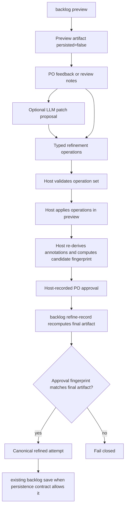

# Backlog Refinement Attempts Design

**Date:** 2026-06-01
**Status:** Accepted
**Spec mode:** proposed_change
**Scope:** Product Backlog draft refinement, edited-attempt recording, and save guards
**Builds on:** `docs/superpowers/specs/2026-06-01-host-derived-brownfield-annotations-design.md`

## Summary

AgileForge needs first-class Product Backlog refinement after backlog preview.
The host-derived brownfield annotation path now makes brownfield previews
inspectable, but Product Owners still need a safe way to retitle, split, merge,
reorder, and clarify specific backlog items before persistence.

The revised design is:

```text
backlog preview
  -> optional LLM patch proposal
  -> host validates typed refinement operations
  -> PO approval
  -> backlog refine-record creates a canonical refined attempt
  -> existing guarded backlog save
```

The Backlog Refiner agent may propose edits, but it does not own accepted
mutations. The host owns canonicalization, validation, brownfield annotation,
attempt recording, and save guards.

## Scrum Premise

Product Backlog items are living artifacts. They evolve as more information is
learned, and refinement can happen repeatedly during a Sprint. The Product
Owner remains accountable for Product Backlog content and ordering, but the work
of documenting or refining items can be delegated to Developers or other
collaborators when the Product Owner retains accountability.

This design follows that boundary:

- Agents and Developers may propose refinement operations.
- The host records proposals as reviewable attempts.
- The Product Owner decides what is accepted and saved.
- Sprint artifacts must not silently continue from stale backlog items.

References:

- Scrum.org, Product Backlog Refinement:
  <https://www.scrum.org/resources/product-backlog-refinement>
- Scrum.org, Product Owner accountabilities:
  <https://www.scrum.org/resources/what-is-a-product-owner>
- Scrum.org, Product Backlog item authorship/delegation:
  <https://www.scrum.org/resources/blog/who-writes-product-backlog-items-scrum>

## Problem Statement

`agileforge backlog preview` can now return a non-mutating, host-annotated
draft. In caRtola, the preview correctly surfaced brownfield warnings such as
`conflicting_invariants`, but several generated items still needed Product
Owner refinement:

- one item mixed verification of existing captain-aware optimization with
  discovery of floor-guard behavior;
- one item mixed verification of an existing real-submit safety lock with
  discovery of a missing submission-plan contract;
- one item needed a title/scope change from greenfield-sounding build work to
  verification/formalization work.

Current AgileForge commands do not provide a first-class way to edit specific
backlog items before save. The available surface is preview/generate/save, so
teams either regenerate and risk unrelated churn, or maintain an external manual
review artifact that cannot be saved through the normal guarded attempt model.

## Goals

- Make backlog refinement a first-class, reviewable AgileForge phase action.
- Preserve the existing guarded save contract: `attempt_id`,
  `expected_artifact_fingerprint`, `expected_state`, and `idempotency_key`.
- Record refined backlog drafts as canonical AgileForge attempts before save.
- Let an LLM propose refinements without making it an authority-bearing editor.
- Support typed operations: split, merge, retitle, rewrite scope, reorder,
  classify, authority ref change, and delete.
- Always re-derive brownfield annotations and warnings from host-owned
  As-Built data.
- Capture split/merge provenance for audit and downstream invalidation.
- Prevent roadmap/story/sprint artifacts from silently pointing at stale or
  rewritten backlog items.
- Keep proposed authority gaps out of saved implementation backlog scope unless
  they are accepted through authority review or explicitly typed as
  non-implementation discovery/intake.
- Keep Product Owner approval host-mediated and fingerprint-bound.

## Non-Goals

- Do not add a second persistence path such as direct `save-edited`.
- Do not let file input bypass canonical attempt recording.
- Do not trust annotations embedded in edited artifacts.
- Do not let natural-language PO feedback mutate saved backlog state directly.
- Do not make the Backlog Refiner agent decide Product Owner approval.
- Do not mutate Sprint Backlog tasks.
- Do not preserve downstream roadmap/story/sprint links without stale checks.

## Proposed Flow



The refined attempt is a normal AgileForge backlog attempt. It is not a raw file
save and not a separate persistence class. If the source preview exists only as
a local JSON artifact, AgileForge must canonicalize that file into a normal
source attempt before recording any refined attempt from it.

## Command Surface

### `agileforge backlog refine-preview`

Non-mutating preview of a refinement operation set.

```sh
agileforge backlog refine-preview \
  --project-id 2 \
  --source-attempt-id <attempt_id> \
  --input "Split item 3 into verification and discovery"
```

`--source-artifact <path>` may be supported for local preview files, but in
preview mode it remains response-only and does not create a saveable attempt.

Expected behavior:

- returns `persisted=false`;
- may call the optional Backlog Refiner agent to propose typed operations;
- host validates the proposed operations;
- host applies operations in memory;
- host re-derives brownfield annotations/warnings;
- returns edited draft, operation diff, warnings, and fingerprints;
- does not create a saveable attempt.

### `agileforge backlog refine-record`

Mutating, guarded command that records a canonical refined attempt.

```sh
agileforge backlog refine-record \
  --project-id 2 \
  --source-attempt-id <attempt_id> \
  --operations-file refinement_ops.json \
  --approval-id <approval_id> \
  --expected-source-fingerprint <fingerprint> \
  --expected-state <state> \
  --idempotency-key refine-backlog-001
```

Expected behavior:

- validates typed operations;
- applies operations to the source attempt artifact;
- re-derives host-owned brownfield annotations and warnings;
- recomputes completeness, priority/order, and artifact fingerprint;
- validates the host-recorded approval against the final artifact fingerprint
  when approval is required;
- writes a normal backlog attempt with `attempt_kind="refinement"`;
- updates active backlog draft state so existing `backlog save` selects the
  refined attempt, not the source attempt;
- returns `attempt_id`, `artifact_fingerprint`, operation summary, and warnings;
- does not persist Product Backlog rows.

`refine-record` requires a canonical `source_attempt_id`. If the user starts
from a local preview file, they must first use `refine-import` so AgileForge can
record a canonical source attempt and then a refined attempt.

If approval-required operations are present and no valid host-recorded approval
exists, `refine-record` may record only a non-saveable pending attempt. It must
fail closed when asked to create a saveable refined attempt whose final artifact
fingerprint does not match the host-recorded approval fingerprint.

### `agileforge backlog approve`

Host-mediated approval boundary for refined backlog attempts or refinement
operation previews.

```sh
agileforge backlog approve \
  --project-id 2 \
  --source-attempt-id <attempt_id> \
  --operation-set-fingerprint <fingerprint> \
  --approved-artifact-fingerprint <fingerprint> \
  --approved-operation-id op-01 \
  --approved-operation-id op-02 \
  --idempotency-key approve-backlog-refinement-001
```

When approving an already recorded pending refined attempt, the command uses
`--attempt-id <refined_attempt_id>` and
`--expected-artifact-fingerprint <fingerprint>` instead of the source/operation
pair. In both forms, approval binds to one exact artifact fingerprint.

Expected behavior:

- records Product Owner approval as an append-only workflow/mutation event;
- binds approval to the exact source attempt, operation-set fingerprint,
  approved artifact fingerprint, and approved operation ids;
- records `approved_by`, `approved_at`, and `approval_source` from the host
  command boundary, not from proposer payloads;
- replays idempotently for the same approval request fingerprint;
- rejects reuse of the same idempotency key with different approval inputs.

Agent/proposer operation payloads may request approval or explain why approval
is needed, but they cannot self-certify `approval.status`, `approved_by`,
`approved_at`, or related fields.

Approval events are single-use for the approved refined attempt unless the host
explicitly records a replay against the same source attempt, operation-set
fingerprint, approved artifact fingerprint, and idempotency key. Mutable
workflow state may cache the latest approval id for convenience, but the trust
boundary is the append-only event.

Preferred Phase 1 approval ordering is pending-then-approve:

1. `refine-record` records a pending non-saveable refined attempt;
2. PO reviews that exact attempt;
3. `backlog approve --attempt-id ... --expected-artifact-fingerprint ...`
   records approval against the recorded artifact;
4. host marks the refined attempt saveable when the approval fingerprint matches.

Approve-before-record against a candidate artifact fingerprint may be supported
later, but pending-then-approve is the default because it avoids candidate/final
drift.

### Existing `agileforge backlog save`

The existing save command remains the only Product Backlog persistence command:

```sh
agileforge backlog save \
  --project-id 2 \
  --attempt-id <refined_attempt_id> \
  --expected-artifact-fingerprint <fingerprint> \
  --expected-state <state> \
  --idempotency-key save-backlog-001
```

No `save-edited` command is introduced.

### File Import

File input is allowed only through canonicalization. This covers both source
preview artifacts and externally edited backlog files.

```sh
agileforge backlog refine-import \
  --project-id 2 \
  --source-artifact backlog-preview.json \
  --edited-file po_reviewed_backlog.json \
  --expected-source-fingerprint <fingerprint> \
  --idempotency-key import-refinement-001
```

`refine-import` must:

1. validate and canonicalize the source artifact;
2. record the source artifact as a normal AgileForge attempt with
   `attempt_kind="imported_preview_source"` when no source attempt already
   exists;
3. translate the edited file into typed operations against that source attempt;
4. validate the operations;
5. re-derive annotations; and
6. record a normal refined attempt.

It must not save Product Backlog rows directly.

### Edited-File Diff Contract

`refine-import` must not infer arbitrary edits with best-effort string
matching. It must use a deterministic diff contract:

1. Every source item receives a stable host-assigned `item_id` and
   `item_fingerprint` before import diffing starts.
2. Edited files must preserve `source_item_id` for unchanged, retitled, or
   rewritten items.
3. A result item with one `source_item_id` is a retitle, rewrite, classify,
   authority ref change, or reorder depending on changed fields.
4. A result item with multiple `source_item_ids` is a merge.
5. Multiple result items with the same single `source_item_id` are a split.
6. A source item with no result item is a delete.
7. Result items with no `source_item_id` are rejected unless they are produced
   by the supported non-implementation intake operation defined below.
8. Reordering is represented by the final ordered result item id list.
9. If matching is ambiguous, `refine-import` fails closed with
   `AMBIGUOUS_REFINEMENT_DIFF`; it must not guess.

## Active Draft Postcondition

`refine-record` is useful only if the refined attempt becomes the current
saveable draft. Recording history is not enough because the existing save path
persists `workflow_state["product_backlog_assessment"]` after checking it
against `attempt_id` and `artifact_fingerprint`.

After successful `refine-record`, AgileForge must:

1. append the refined attempt to `workflow_state["backlog_attempts"]`;
2. set refined attempt metadata:
   - `attempt_id`;
   - `artifact_fingerprint`;
   - `attempt_kind="refinement"`;
   - `source_attempt_id`;
   - `source_artifact_fingerprint`;
   - `operation_ids`;
   - authority and As-Built fingerprints;
3. set `workflow_state["product_backlog_assessment"]` to the refined output
   artifact;
4. set `product_backlog_assessment["attempt_id"]` to the refined `attempt_id`;
5. set `product_backlog_assessment["artifact_fingerprint"]` to the refined
   artifact fingerprint;
6. mirror refined `backlog_items` into `workflow_state["backlog_items"]`;
7. preserve earlier source attempts in history;
8. set or keep `workflow_state["fsm_state"] = "BACKLOG_REVIEW"`;
9. set `workflow_state["backlog_review_origin"] = "next_cycle_refinement"` when
   entering review from `SPRINT_COMPLETE`;
10. make the refined attempt the only valid target for the next
    `agileforge backlog save` call unless another generate/refine command
    supersedes it.

Idempotent replay with the same key and same request fingerprint returns the
same refined attempt and must not append another attempt.

## Backlog Refiner Agent Role

The Backlog Refiner agent is optional and proposal-only.

Inputs:

- source backlog attempt artifact;
- host-derived `as_built_annotation`;
- `brownfield_warnings`;
- compiled authority summary;
- As-Built cache metadata/fingerprint;
- Product Owner feedback;
- Definition of Ready/readiness rules;
- source attempt fingerprint.

Outputs:

- typed refinement operations;
- rationale per operation;
- uncertainty/warnings;
- open questions when feedback is insufficient.

The agent may not:

- persist backlog rows;
- decide Product Owner approval;
- change As-Built truth;
- create authority refs without host validation;
- bypass typed operations;
- write raw edited backlog artifacts as accepted attempts.

## Typed Operation Schema

All refinements are represented as typed operations. Natural-language feedback
may request operations, but the host only accepts typed operations.

### Stable Item Identity

Before any refinement operation can reference backlog items, the host must
ensure every source item has:

- `item_id`;
- `item_fingerprint`;
- source attempt id;
- source artifact fingerprint.

If a source artifact came from `backlog preview` and lacks item ids, import or
recording must assign deterministic ids such as `item-001`, `item-002`, based on
canonical source order, and compute fingerprints from canonical item JSON.

Common fields:

```json
{
  "operation_id": "op-01",
  "operation_type": "split",
  "source_attempt_id": "backlog-attempt-1",
  "source_artifact_fingerprint": "sha256:...",
  "source_item_ids": ["item-003"],
  "source_item_fingerprints": ["sha256:..."],
  "result_item_ids": ["item-003a", "item-003b"],
  "authority_fingerprint": "sha256:...",
  "as_built_cache_fingerprint": "sha256:...",
  "rationale": "Separate verification of observed behavior from discovery of missing floor-guard behavior.",
  "requested_by": "po | agent | developer",
  "approval_request": {
    "required": true,
    "reason": "Split changes backlog item scope."
  },
  "warnings": []
}
```

Operation types:

| Type | Meaning | Required result data |
| --- | --- | --- |
| `split` | Replace one item with multiple scoped items | full result items, source item id |
| `merge` | Combine multiple items into one item | full result item, all source ids |
| `retitle` | Change title/requirement only | new title |
| `rewrite_scope` | Change description, technical note, acceptance scope, or rationale | changed fields |
| `reorder` | Change priority/order | ordered item ids or priority deltas |
| `classify` | Change item category such as verification/discovery/product-new-work | new classification |
| `authority_ref_change` | Add, remove, or replace authority refs | old/new refs and rationale |
| `delete` | Remove an item from the draft | reason and source item id |
| `add_intake` | Add non-implementation discovery/intake only | intake item, authority gap metadata |

Ordinary net-new Product Backlog implementation items are not allowed through
refinement in Phase 1. New implementation scope must come from backlog
generation or authority/intake review. `add_intake` is the only supported
operation that may create a result item without source ids, and it must produce
non-implementation intake work.

Operation validation must reject:

- unknown operation types;
- missing source item ids;
- source item fingerprint mismatch;
- result item ids that collide unintentionally;
- authority refs not present in compiled authority or As-Built candidate set,
  unless host-validated as a proposed authority gap;
- operation sets that produce invalid backlog schema;
- result items with no source ids and no supported `add_intake` operation;
- operation sets that delete all backlog items without explicit PO approval.

### Approval Requirements

All refined attempts require Product Owner acceptance before save because the
saved Product Backlog is a PO-owned artifact.

Approval is host-mediated. Proposer payloads cannot create approval. The host
records approval with `agileforge backlog approve` or an equivalent save-boundary
approval event, and the approval is bound to the final artifact fingerprint.

Some operations additionally require host-recorded PO approval before
`refine-record` can create a saveable refined attempt:

| Operation | Explicit PO approval required before saveable attempt? |
| --- | --- |
| `retitle` | No, but save still requires PO acceptance of the whole attempt |
| `rewrite_scope` | No, unless it changes product scope materially |
| `classify` | No, unless it changes product/new-work vs verification/discovery |
| `split` | Yes |
| `merge` | Yes |
| `reorder` | Yes |
| `authority_ref_change` | Yes |
| `delete` | Yes |

When explicit approval is required, the host approval record must carry:

- approval id;
- source attempt id;
- operation-set fingerprint;
- approved artifact fingerprint;
- approved operation ids;
- approved by;
- approved at;
- approval source;
- idempotency key;
- request fingerprint.

If host approval is missing, the host may still produce a preview, but
`refine-record` must either reject the operation or record a non-saveable
pending attempt with a blocking warning.

### Derive, Approve, Record, Fingerprint Ordering

The ordering is fixed:

1. host applies typed operations to the source artifact;
2. host discards inbound annotations;
3. host re-derives brownfield annotations and warnings;
4. host recomputes completeness, priority/order, and item fingerprints;
5. host computes the candidate artifact fingerprint;
6. Product Owner approval is recorded against that candidate fingerprint;
7. `refine-record` recomputes the final artifact in the same order;
8. `refine-record` fails closed unless the final artifact fingerprint equals
   the host-recorded approval fingerprint when approval is required;
9. only then may `refine-record` create a saveable refined attempt.

Approval never silently transfers to a different artifact after annotation
re-derivation or operation replay.

### Authority Gap Handling

Phase 1 must fail closed for unsupported implementation scope.

If an operation introduces an authority ref that is not present in compiled
authority or the As-Built target set, the host may retain it only as one of:

- a proposed authority gap review note; or
- a non-implementation discovery/intake item explicitly classified as
  `authority_gap_intake`.

Unsupported authority gaps must emit `AUTHORITY_GAP_BLOCKS_SAVE` with
`severity="block_on_save"` unless one of these conditions is true:

1. authority review accepts and recompiles the new authority before save; or
2. the item is host-validated as non-implementation discovery/intake and does
   not claim to implement product scope.

Authority-gap items must not be persisted as ordinary implementation backlog
items merely because they were produced by a refinement operation.

`authority_gap_intake` is structurally non-implementation work:

- it cannot use implementation verbs such as build/add/implement/create for
  product behavior;
- it cannot be saved as ordinary `backlog_seed` implementation work;
- it cannot flow into sprint planning as build scope;
- it can only route to authority review, discovery, or intake handling;
- classification into or out of intake is host-validated, not proposer-asserted.

Phase 1 mechanism:

- `authority_gap_intake` items are stored in a host-side
  `backlog_intake_items` / `authority_gap_intake_items` collection on the
  refined attempt artifact, not in the savable `backlog_items` list.
- The savable projection passed to the existing `save_backlog_tool` excludes
  intake items.
- Intake items must carry intake metadata and remain visible in the refined
  attempt review artifact.
- Later authority review may promote an intake item into compiled authority and
  a future backlog generation/refinement cycle may then create ordinary
  implementation backlog work.

Until a distinct persisted `story_origin` or intake table exists, no intake item
may be materialized as `story_origin="backlog_seed"`.

## Post-Operation Completeness Rules

After operations are applied, the host recomputes:

- `is_complete`;
- priority/order;
- unique priorities;
- item count;
- required backlog item fields;
- clarifying questions;
- brownfield warnings;
- item fingerprints;
- artifact fingerprint.

Rules:

- Priorities must be normalized into a unique ordered sequence.
- Empty or invalid items make the refined draft incomplete.
- If delete operations drop the backlog below the minimum complete threshold,
  `is_complete=false` and save is blocked.
- If operation output leaves clarifying questions, `is_complete=false` and save
  is blocked.
- A non-saveable pending attempt may still be recorded for review if the command
  explicitly allows pending attempts; otherwise `refine-record` fails closed.

## Split/Merge Provenance

Every split or merge result item must be traceable to source items.

Required provenance per result item:

- source attempt id;
- source item ids;
- source item fingerprints;
- operation id;
- operation type;
- source artifact fingerprint;
- authority fingerprint;
- As-Built cache fingerprint;
- rationale;
- approval status;
- warnings.

This provenance allows downstream roadmap/story/sprint phases to detect whether
they are linked to stale backlog items.

## Brownfield Annotation Rules

Refinement never trusts embedded annotations from input files or agent output.

After operations are applied, the host must:

1. discard any inbound `as_built_annotation`;
2. match items against current host-owned As-Built data;
3. derive fresh `as_built_annotation`;
4. derive fresh `brownfield_warnings`;
5. include the As-Built cache fingerprint in the attempt metadata.

If the As-Built cache is missing or stale, refinement may still produce a draft,
but must emit a warning and mark brownfield annotation status as unavailable.
Saving a brownfield-reviewed backlog with stale/missing As-Built remains subject
to the existing save guard rules defined by the host-derived annotation design.

## Savable Item Projection

Backlog attempt artifacts may include host-only fields such as:

- `item_id`;
- `item_fingerprint`;
- `as_built_annotation`;
- `brownfield_warnings`;
- `classification`;
- split/merge provenance;
- intake metadata.

The existing `BacklogItem` schema uses `extra="forbid"` and the existing
`save_backlog_tool` validates each item with that schema before creating
`UserStory` rows. Therefore saving a refined attempt requires a host-owned
savable projection:

1. take only implementation Product Backlog items from the active refined
   artifact;
2. exclude `authority_gap_intake` / non-implementation intake items;
3. strip host-only fields from each item;
4. keep only fields accepted by `BacklogItem`;
5. validate the projected items with `BacklogItem`;
6. pass the projected list to `save_backlog_tool`;
7. preserve full host metadata in the attempt artifact/history, not in the
   projected save payload.

This projection is mandatory before AC6 can hold for projects where the shipped
replacement guard permits save.

## Workflow-State Rules

Preview from `SPRINT_COMPLETE` is allowed because it is non-mutating and useful
for next-cycle planning.

Phase 1 uses Mode A for refinement recording by reusing the existing
`BACKLOG_REVIEW` state as the explicit next-cycle backlog review state.

Rules:

- `refine-preview` is allowed from `SPRINT_COMPLETE` and does not mutate state.
- `refine-record` is allowed from `SPRINT_COMPLETE` only when it records a
  next-cycle refinement attempt and transitions state to `BACKLOG_REVIEW`.
- `refine-record` is also allowed from `BACKLOG_REVIEW` to supersede the active
  refined draft with another reviewed draft.
- `backlog save` remains allowed only with `expected_state=BACKLOG_REVIEW`.
- `refine-record --expected-state` is the precondition state supplied by the
  caller. When the precondition is `SPRINT_COMPLETE`, the successful
  postcondition is `BACKLOG_REVIEW`.
- `BACKLOG_REVIEW` entered from `SPRINT_COMPLETE` must carry
  `backlog_review_origin="next_cycle_refinement"` and source sprint/backlog
  metadata so downstream stale checks can distinguish it from initial project
  backlog creation.

Mode B, versioned backlog persistence from `SPRINT_COMPLETE` without replacing
existing active backlog seeds, is deferred. It requires broader downstream
versioning and a changed persistence contract.

Mode C, preview-only from `SPRINT_COMPLETE`, remains the safe fallback if
implementation discovery shows that reusing `BACKLOG_REVIEW` causes unacceptable
FSM churn.

## Downstream Compatibility

Roadmap, Story, and Sprint artifacts must not silently point at rewritten
Product Backlog items.

At minimum, downstream records that originate from backlog items need:

- backlog attempt id or saved backlog version id;
- source item id;
- source item fingerprint;
- authority ref;
- lineage operation id when item came from refinement.

When a refined backlog is recorded from a completed project, AgileForge must set
coarse stale markers in workflow state:

```json
{
  "downstream_backlog_stale": true,
  "stale_backlog_reason": "refined_backlog_recorded",
  "stale_since_backlog_attempt_id": "backlog-attempt-9"
}
```

Roadmap, Story, and Sprint generation must fail or request review when these
markers are present.

Rules:

- A roadmap generated from an old backlog attempt must not be reused as current
  after a refined backlog is recorded or saved.
- A story generated from a deleted or split backlog item must require review.
- Sprint planning must use the latest accepted backlog version unless the user
  explicitly chooses a historical version.
- Active sprint tasks are not rewritten by backlog refinement.

Phase 1 uses coarse workflow-state markers instead of per-artifact lineage
fields. Per-roadmap/story/sprint item lineage is deferred to a later versioning
enhancement.

Stale marker exit:

- `roadmap generate` or `roadmap save` against the refined backlog may clear the
  marker when it records a new roadmap artifact whose input context references
  `stale_since_backlog_attempt_id`;
- alternatively, a future explicit acknowledgement command may clear it with
  expected-state, expected-backlog-attempt, and idempotency guards;
- until one of those paths exists, downstream commands must treat the marker as
  blocking/review-required.

### Save Path and Existing Replacement Guard

The shipped `save_backlog_tool` replaces active `backlog_seed` stories by
superseding old seed rows and creating new seed rows. It blocks replacement when
active stories have progressed downstream, have acceptance criteria, changed
status, are already refined, are not `backlog_seed`, or have sprint links.

Therefore Phase 1 does not promise that a refined backlog recorded from
`SPRINT_COMPLETE` can be saved through the existing persistence path.

Phase 1 behavior:

- `refine-preview` from `SPRINT_COMPLETE` is allowed.
- `refine-record` from `SPRINT_COMPLETE` is allowed and records a canonical,
  approved/pending next-cycle refined attempt in `BACKLOG_REVIEW`.
- `backlog save` may still fail with the existing replacement guard when
  downstream stories or sprint links exist.
- In that common case, persistence is deferred until a later slice implements
  either:
  - downstream reconciliation before replacement; or
  - versioned/superseding backlog save that does not delete or replace progressed
    downstream artifacts.

For projects with no progressed downstream backlog rows, existing
`backlog save` may save the refined attempt using the normal guard model.

## Data Model Direction

First implementation should prefer extending existing workflow-state attempt
records over new tables if feasible.

Required attempt metadata:

- `attempt_id`;
- `attempt_kind`:
  `generated | generated_refinement | preview | imported_preview_source |
  refinement | import_refinement`;
- `trigger`: existing history-compatible trigger value;
- `source_attempt_id`;
- `source_artifact_path` for imported local artifacts;
- `source_artifact_fingerprint`;
- `artifact_fingerprint`;
- `authority_fingerprint`;
- `as_built_cache_fingerprint`;
- `operation_ids`;
- `operation_summary`;
- `brownfield_warning_counts`;
- `created_by`;
- `created_at`;
- `idempotency_key` for mutating commands.
- approval event id when the attempt is approved/saveable;
- saveable projection fingerprint when a projection exists.

`attempt_kind` must not break existing history consumers. It maps onto existing
trigger semantics:

| Existing/new trigger | `attempt_kind` |
| --- | --- |
| `auto_transition` | `generated` |
| `manual_refine` | `generated_refinement` |
| `preview` | `preview` |
| `refine_record` | `refinement` |
| `refine_import_source` | `imported_preview_source` |
| `refine_import` | `import_refinement` |

If existing attempt storage cannot safely carry this metadata without creating
ambiguous records, add a small typed refinement metadata envelope rather than a
parallel Product Backlog persistence path.

## Error Handling

All commands return the standard envelope:

```json
{
  "ok": false,
  "data": null,
  "warnings": [],
  "errors": [
    {
      "code": "INVALID_REFINEMENT_OPERATION",
      "message": "...",
      "details": {
        "operation_id": "op-01",
        "source_item_id": "item-003"
      }
    }
  ]
}
```

Representative errors:

| Code | Meaning |
| --- | --- |
| `INVALID_REFINEMENT_OPERATION` | Typed operation schema or semantic validation failed |
| `AMBIGUOUS_REFINEMENT_DIFF` | Edited-file import could not deterministically map changes to operations |
| `SOURCE_ATTEMPT_STALE` | Source attempt fingerprint does not match expected value |
| `SOURCE_ITEM_STALE` | Source item fingerprint does not match expected value |
| `UNSUPPORTED_AUTHORITY_REF` | Operation asserted an authority ref not backed by authority/As-Built |
| `AUTHORITY_GAP_BLOCKS_SAVE` | Proposed authority gap cannot be saved as implementation backlog work |
| `APPROVAL_FINGERPRINT_MISMATCH` | Host approval fingerprint does not match final refined artifact |
| `APPROVAL_REQUIRED` | Saveable refinement requires host-recorded PO approval |
| `BACKLOG_REPLACEMENT_BLOCKED` | Existing save path blocks replacement because downstream work progressed |
| `REFINEMENT_STATE_BLOCKED` | Current workflow state does not allow recorded refinement |
| `DOWNSTREAM_ARTIFACT_STALE` | Downstream generation is blocked until stale backlog lineage is reviewed |

## Security and Integrity

- Mutating commands require idempotency keys.
- File imports must be schema-validated and canonicalized into operations.
- Imported annotations are discarded.
- Fingerprints must be computed from canonical JSON with sorted keys.
- Operation replay with the same idempotency key and same request fingerprint
  returns the original result.
- Reuse of an idempotency key with changed inputs fails closed.

`refine-record` request fingerprint includes at least:

- project id;
- source attempt id;
- source artifact fingerprint;
- canonical operations;
- authority fingerprint;
- As-Built cache fingerprint;
- expected state;
- approval id, when supplied;
- approved artifact fingerprint, when approval is required.

`backlog approve` request fingerprint includes at least:

- project id;
- source attempt id;
- operation-set fingerprint;
- approved artifact fingerprint;
- approved operation ids;
- approval source.

## Acceptance Criteria

1. `backlog refine-preview` returns `persisted=false` and does not change backlog
   history.
2. `backlog approve` records host-mediated PO approval bound to source attempt,
   operation-set fingerprint, approved operation ids, and approved artifact
   fingerprint; proposer-authored approval fields are ignored.
3. `backlog refine-record` creates a canonical refined attempt with
   `attempt_kind="refinement"` and does not persist Product Backlog rows.
4. `backlog refine-record` makes the refined output artifact the active
   `product_backlog_assessment`, attaches the refined `attempt_id` and
   `artifact_fingerprint`, mirrors refined backlog items, preserves history,
   and sets/keeps `fsm_state="BACKLOG_REVIEW"`.
5. Approval-required refinements fail closed or remain non-saveable unless the
   final recorded artifact fingerprint matches the host approval fingerprint.
6. Existing `backlog save` can save a refined attempt only when the existing
   backlog replacement guard allows replacement; from common `SPRINT_COMPLETE`
   brownfield cases with progressed stories/sprint links, save is deferred until
   downstream reconciliation or versioned persistence exists.
7. No direct `save-edited` path exists.
8. File import creates a canonical refinement attempt before any save.
9. Source preview files are canonicalized into a source attempt before refined
   attempts are recorded from them.
10. Edited imports must preserve `source_item_id`; result items with no source
    id fail closed unless produced by a host-validated non-implementation
    `add_intake` operation.
11. Host re-derives annotations/warnings and discards embedded annotations.
12. Host recomputes completeness, priority/order, unique priorities, item count,
    required fields, clarifying questions, item fingerprints, and artifact
    fingerprint after operations.
13. Split/merge provenance records source and result item lineage.
14. A stale source artifact fingerprint blocks `refine-record`.
15. A stale source item fingerprint blocks the affected operation.
16. Unsupported authority refs are blocked from save unless authority review
    accepts/compiles them or the item is explicitly typed as
    non-implementation discovery/intake.
17. `authority_gap_intake` cannot become ordinary `backlog_seed`
    implementation work and cannot flow into sprint planning as build scope;
    Phase 1 keeps intake items out of savable `backlog_items` and out of the
    `save_backlog_tool` payload.
18. Refinement from `SPRINT_COMPLETE` sets coarse stale markers
    (`downstream_backlog_stale`, `stale_backlog_reason`,
    `stale_since_backlog_attempt_id`); later roadmap/story/sprint generation
    blocks or requests review when those markers are present.
19. Saving a refined attempt uses a savable projection that strips host-only
    fields and validates projected items with `BacklogItem` before calling
    `save_backlog_tool`.
20. Active sprint tasks are not mutated by backlog refinement.

## Open Questions

1. Should `refine-preview` store an ephemeral attempt id for easier review, or
   remain completely response-only?
2. Should proposed authority gaps create authority-review candidates
   automatically, or only warnings in Phase 1?
3. Which later persistence path should support completed-project refined
   backlogs: downstream reconciliation before replacement, or versioned
   superseding save?

## Rejected Options

### Direct `save-edited --edited-artifact`

Rejected because it creates a second persistence path that can bypass canonical
attempt recording, save guards, and lineage.

### Authority-bearing Backlog Refiner Agent

Rejected because agents can propose useful edits but must not own accepted
Product Backlog mutations or As-Built truth.

### Trust Embedded Annotations

Rejected because edited files and model output can drift from host-owned
As-Built data. Annotations must be re-derived.

### Regenerate Until Text Looks Right

Rejected because regeneration changes unrelated backlog items and restarts
review noise. Refinement should apply focused typed operations to a known
source artifact.

## Review Notes

This spec deliberately stops before implementation planning. It defines the
architecture boundary and contracts that need approval before `writing-plans`.
