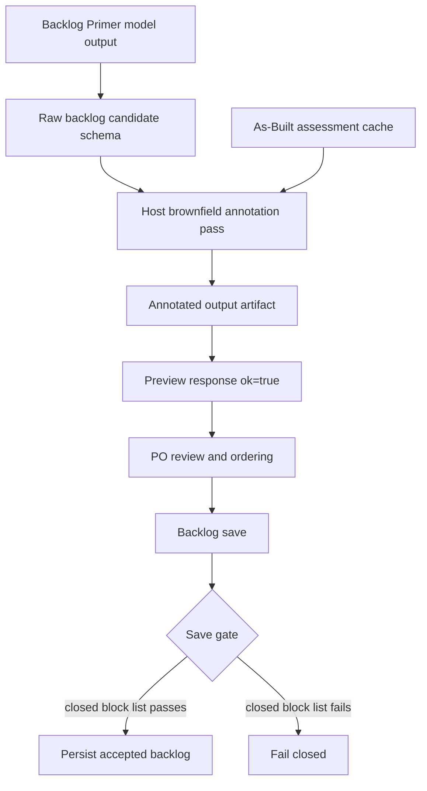

# Host-Derived Brownfield Annotations Design

**Date:** 2026-06-01  
**Status:** Accepted  
**Spec mode:** proposed_change  
**Scope:** Backlog preview/save brownfield metadata contract  
**Supersedes:** `docs/superpowers/specs/2026-05-30-brownfield-backlog-item-contract-design.md`

## Summary

AgileForge must stop requiring the Backlog Primer model to author exact
As-Built metadata. That contract is inverted: the host owns As-Built data and
already performs matching, while the model is responsible for proposing Product
Backlog candidates.

The replacement design is:

1. Backlog Primer emits Product Backlog candidates with at most `authority_ref`
   and optional `capability_hint`.
2. The host derives `as_built_annotation` after model generation.
3. `backlog preview` returns `ok: true` with structured
   `brownfield_warnings[]` for reviewable ambiguity.
4. `backlog save` validates the fingerprinted, host-annotated artifact and
   blocks only a small closed set of unsafe cases.

This keeps As-Built as deterministic implementation-state evidence without
making invariant-level assessment rows an equality oracle for product-level
backlog items.

## Problem Statement

The current brownfield preview path fails closed when Backlog Primer output does
not exactly transcribe fields from `as_built_assessment_cached`.

Repeated caRtola preview smokes showed a moving failure surface:

- missing `capability_name`;
- wrong `recommended_backlog_treatment`;
- ambiguous `authority_ref`;
- title-prefix mismatches;
- `invariant_ref` vs `authority_ref` selection issues;
- model/As-Built semantic disagreement.

This is not convergence. It is a responsibility and granularity mismatch:

- As-Built is invariant-level implementation evidence.
- Product Backlog items are product/work-item-level candidates.
- Some authority refs have multiple invariant rows with conflicting
  status/treatment.
- The model can propose useful backlog items without being able to transcribe
  the exact As-Built row the host expected.

## Goals

- Preserve As-Built as deterministic implementation-state input.
- Keep Backlog Primer focused on backlog candidate ideation and prioritization.
- Derive brownfield metadata in the host from authoritative As-Built data.
- Keep `backlog preview` non-mutating and non-blocking for PO review.
- Surface brownfield ambiguity as structured agent-facing warnings.
- Make the saved attempt persist the exact host-derived annotations that were
  produced at preview/generation time.
- Keep mutation-adjacent save operations fail-closed only for true unsafe cases.
- Avoid a new fuzzy-matcher tuning loop.

## Non-Goals

- Do not make As-Built generate the Product Backlog directly.
- Do not collapse invariant-level As-Built rows into product-level rows.
- Do not continue expanding `BROWNFIELD CONTRACT RETRY` prompt feedback.
- Do not add more title-prefix validator branches.
- Do not require Backlog Primer to emit `capability_name`, `as_built_status`, or
  `recommended_backlog_treatment`.
- Do not auto-resolve fuzzy matches or conflicting invariant rows.
- Do not add new database tables in the first slice.

## Current Failure Evidence

Latest known failure at commit `27307f80e6c13ead7c0d05f97ab55975c0e7d700`:

```text
Backlog brownfield contract validation failed:
backlog_items[1] missing capability_name;
backlog_items[16] missing capability_name;
backlog_items[29] capability_name must match 'Security Secrets';
backlog_items[29] as_built_status must equal 'not_observed';
backlog_items[29] recommended_backlog_treatment must equal 'create_discovery_item'
```

Items 1 and 16 already included exact authority refs plus matching status and
treatment. The host could fill `capability_name`.

Item 29 is not just a typo. The model inferred secrets protection from repo
hygiene while As-Built marked direct proof as `not_observed`. That disagreement
is useful PO/reconciliation signal and must be represented as data, not erased.

## Proposed Architecture



Responsibilities:

| Layer | Responsibility |
| --- | --- |
| Backlog Primer model | Propose prioritized backlog candidates; may provide `authority_ref` and `capability_hint` |
| Host annotation pass | Match candidates to As-Built, derive annotation, emit warnings |
| Product Owner | Review warnings, order/approve backlog |
| Save gate | Validate reviewed annotated artifact was not stale or tampered |

## Model Output Contract

The Backlog Primer model output should contain only product/backlog fields plus
lightweight hints:

```json
{
  "priority": 1,
  "requirement": "Validate Captain-Aware Optimizer Contract",
  "authority_ref": "REQ.captain-aware-optimization",
  "capability_hint": "captain optimizer",
  "value_driver": "Strategic",
  "justification": "This validates an existing high-impact decision path.",
  "estimated_effort": "M",
  "technical_note": "Validate current behavior rather than rebuilding it."
}
```

The model must not be required to emit:

- `capability_name`;
- `as_built_status`;
- `recommended_backlog_treatment`.

Those fields are host-owned and appear only inside host-derived annotations.

## Annotation Schema

Each `backlog_items[]` entry in the output artifact receives an
`as_built_annotation` object.

```json
{
  "schema_version": "agileforge.brownfield_annotation.v1",
  "source": "host_derived",
  "match_tier": "exact",
  "match_basis": ["authority_ref"],
  "conflict": false,
  "selected": {
    "authority_ref": "REQ.captain-aware-optimization",
    "capability_title": "Captain Aware Optimization",
    "invariant_refs": ["INV-fc0fa3f2bf302cd7"],
    "as_built_status": "observed_with_missing_evidence",
    "recommended_backlog_treatment": "create_verification_item",
    "confidence": "medium"
  },
  "candidates": [],
  "model_assertion": {
    "source": "model_asserted",
    "authority_ref": "REQ.captain-aware-optimization",
    "capability_hint": "captain optimizer",
    "as_built_status": null,
    "recommended_backlog_treatment": null
  },
  "disagreements": [],
  "warning_codes": []
}
```

The annotation subtree uses a present-with-null serialization contract.
Optional annotation keys such as `selected`, `model_assertion.as_built_status`,
and `model_assertion.recommended_backlog_treatment` must remain present with
JSON `null` when unset. The normal backlog item may still omit unrelated
optional model fields, but host annotations must not be serialized with
`exclude_none=True`.

`selected.confidence` uses the same As-Built confidence enum as the assessor:
`high`, `medium`, or `low`.

### Enum: `match_tier`

| Value | Meaning | Blocking |
| --- | --- | --- |
| `exact` | Matched by exact `authority_ref` or `invariant_ref` equality | Non-blocking unless save gate detects unbacked assertion/tamper |
| `fuzzy` | Matched only by title/term heuristic | Non-blocking warning; never authoritative |
| `none` | No match found | Non-blocking unless model asserted an unmatched `authority_ref` at save |

Exact matching may still produce `conflict: true` when the same
authority-level capability has multiple invariant rows with different
status/treatment. In that case `selected` is `null`, `candidates[]` contains all
candidate contracts, and `warning_codes` includes `conflicting_invariants`.

### Enum: `source`

| Value | Meaning |
| --- | --- |
| `host_derived` | Annotation produced by AgileForge after model output |
| `model_asserted` | Raw model-provided hint/assertion captured for comparison |

Top-level `as_built_annotation.source` is `host_derived`. Raw model hints live
inside `model_assertion.source = "model_asserted"` so both provenances can be
shown side by side.

### Disagreement Schema

Disagreements are structured:

```json
{
  "field": "as_built_status",
  "model_value": "observed",
  "host_value": "not_observed",
  "code": "status_disagreement"
}
```

Item 29 from caRtola must be representable as:

- model value: `observed / skip_new_implementation`;
- host value: `not_observed / create_discovery_item`;
- warning codes: `status_disagreement`, `treatment_disagreement`;
- no preview failure.

## Warning Schema

Preview and generation output artifacts include top-level
`brownfield_warnings[]`.

```json
{
  "code": "status_disagreement",
  "item_index": 28,
  "severity": "review",
  "match_tier": "exact",
  "authority_ref": "QUALITY.security-secrets",
  "invariant_refs": ["INV-506454637a21ed73"],
  "message": "Model assertion disagrees with As-Built status.",
  "details": {
    "model_value": "observed",
    "host_value": "not_observed"
  }
}
```

`item_index` is zero-based and refers to the index in `backlog_items[]`. Human
logs may still display one-based labels, but structured warning data uses
zero-based indexes.

Warnings must be bounded and code-first. Free text may explain a warning, but no
warning may exist only as prose.

Warnings are deduplicated by `(code, item_index, authority_ref, invariant_refs)`
and capped at three warnings per backlog item. If more warnings are possible,
the host must keep the three highest-severity warnings using this severity
order: `block_on_save`, then `review`, then `info`.

The cap must never evict a `block_on_save` warning. If an item produces more
than three `block_on_save` warnings, keep all `block_on_save` warnings and drop
lower-severity warnings first.

### Enum: `BrownfieldWarningCode`

| Code | Meaning | Preview | Save |
| --- | --- | --- | --- |
| `metadata_filled_by_host` | Host filled omitted brownfield fields from exact match | Warn | Non-blocking |
| `possible_mapping` | Fuzzy/title-term match found possible As-Built candidates | Warn | Non-blocking |
| `looks_mapped_but_unmatched` | Item text looks like a known capability but no exact match exists | Warn | Non-blocking |
| `conflicting_invariants` | Exact authority-level match has multiple invariant contracts | Warn | Non-blocking |
| `status_disagreement` | Model status assertion differs from host As-Built status | Warn | Non-blocking |
| `treatment_disagreement` | Model treatment assertion differs from host As-Built treatment | Warn | Non-blocking |
| `capability_disagreement` | Model capability name/hint differs from selected host capability | Warn | Non-blocking |
| `asserted_authority_ref_unmatched` | Model asserted an `authority_ref` matching no As-Built capability | Warn | **Blocking at save** |

## Matching Rules

### Exact Match

Exact match uses equality after existing AgileForge ID normalization:

- item `authority_ref` equals As-Built `authority_ref`;
- item `authority_ref` equals one As-Built `invariant_refs[]` entry.

Only exact matches may produce authoritative host annotation.

If an exact `authority_ref` or `invariant_ref` match is found, and the match has
a single selected capability, the host must compute normalized token sets for:

- selected As-Built `capability_title`;
- item `requirement`;
- item `capability_hint`, when present.

Normalization uses the existing brownfield text normalization and token rules:
lowercase, punctuation-insensitive tokens, existing stopword removal, and the
existing plural-trim behavior. Emit `capability_disagreement` when the selected
capability title has at least one token and neither the requirement tokens nor
the capability-hint tokens overlap it.

For exact matches with `conflict: true` and `selected: null`, skip
`capability_disagreement` and emit `conflicting_invariants` instead. There is no
single selected capability title to compare.

### Fuzzy Match

Fuzzy match may use existing title/term heuristics such as
`_possible_unmapped_capability_matches`.

Fuzzy matches must never silently fill authoritative metadata. They produce
`match_tier: "fuzzy"`, `possible_mapping` warnings, and candidate lists for PO
review.

This avoids moving the old loop from prompt tuning to token-threshold tuning.

### No Match

No match produces `match_tier: "none"`. If the model asserted an `authority_ref`
that matches no As-Built capability, preview warns with
`asserted_authority_ref_unmatched` and save blocks.

### No As-Built Assessment

If backlog input contains `as_built_assessment == "NO_AS_BUILT_ASSESSMENT"`,
the host must not attach brownfield annotations and must emit
`brownfield_warnings: []`. This is the greenfield/no-evidence path. Save still
uses the normal artifact fingerprint guard, but it must not run
As-Built-specific warning checks because there is no authoritative As-Built
surface to compare against.

A malformed As-Built assessment is one that is present but fails
`AsBuiltAssessment.model_validate_json`. That remains an input-validation
failure, not a brownfield warning.

## Artifact Fingerprints

Host annotation is part of the fingerprinted artifact.

Preview/generation must:

1. produce model output;
2. derive annotations and warnings;
3. attach `as_built_annotation` to each item;
4. attach top-level `brownfield_warnings[]`;
5. compute the normal `artifact_fingerprint` over the annotated artifact.

Save must validate the persisted annotated artifact. It must not re-derive
annotations from the current As-Built cache and compare those to preview.

Save validation must recompute the normal backlog artifact fingerprint from the
persisted annotated artifact and compare it with the reviewed
`expected_artifact_fingerprint`. Because save metadata is added after the
preview/generation fingerprint is computed, recomputation must exclude
post-generation guard fields such as top-level `attempt_id` and
`artifact_fingerprint`.

`artifact_fingerprint_mismatch` means the persisted annotated artifact is not
the one the host produced at preview/generation time.

Persisted backlog attempts must not share mutable object identity with mirrored
workflow-state convenience fields such as `state["backlog_items"]`. When a
phase attempt records `output_artifact` and mirrors `backlog_items`, both values
must be deep-copied. Otherwise PO review/order mutations against the mirror can
change the reviewed artifact and cause legitimate saves to fail fingerprint
recomputation.

The pre-save reviewed artifact is immutable. Any PO edit, reorder, or refinement
before save must produce a new backlog attempt and a new artifact fingerprint.
Editing `state["backlog_items"]` directly before save is a local convenience
mutation only; it is not persisted by `backlog save`.

## Save Gate

The brownfield save block list is closed and small:

1. model asserted `authority_ref` matches zero As-Built capabilities;
2. stale or missing preview/generate artifact fingerprint;
3. recomputed persisted artifact fingerprint differs from the reviewed
   fingerprint.

`save_backlog_draft` must invoke the brownfield warning gate after the normal
artifact fingerprint guard and before it calls `save_backlog_tool`.

Everything else is non-blocking warning data:

- missing model metadata;
- fuzzy matches;
- conflicting invariants;
- model/As-Built status disagreement;
- model/As-Built treatment disagreement;
- item text that looks mapped but lacks exact match;
- host-filled metadata.

## Migration

This is a deliberate behavior change from the accepted
`2026-05-30-brownfield-backlog-item-contract-design.md`.

Required migrations:

- Remove `capability_name`, `as_built_status`, and
  `recommended_backlog_treatment` from the model-required Backlog Primer prompt.
- Keep or add `authority_ref` and optional `capability_hint` as the only
  model-authored brownfield fields.
- Introduce host-owned `as_built_annotation`.
- Replace preview fail-closed behavior with warning-producing annotation.
- Move strict brownfield checks to save.
- Remove the brownfield preview retry path.

Existing tests that assert preview fails closed on brownfield contract errors
must be rewritten as warning assertions.

## Test Delta

Rewrite or replace these current test classes/behaviors:

- `test_backlog_preview_surfaces_brownfield_contract_failure`
  - New expectation: preview returns `ok: true` / `success: true` and structured
    `brownfield_warnings[]`.
- Brownfield retry metadata tests
  - New expectation: preview invokes Backlog Primer once; no
    `BROWNFIELD CONTRACT RETRY` metadata on preview.
- Strict equality tests for `capability_name`, `as_built_status`, and
  `recommended_backlog_treatment`
  - Move to save path only when they represent hallucination/tamper; otherwise
    rewrite as annotation/warning tests.
- Title-prefix validation tests
  - Remove as hard validation; title hygiene may remain as warning or host title
    normalization if already implemented, but it must not block preview.

New required tests:

1. exact authority match fills host annotation and warning
   `metadata_filled_by_host`;
2. exact invariant match selects the invariant-level capability;
3. fuzzy match produces `possible_mapping` and no authoritative selected
   annotation;
4. conflicting invariant rows produce `conflicting_invariants` and candidate
   list;
5. model/As-Built disagreement produces both values side by side;
6. preview returns success with warnings for the latest caRtola failure shape;
7. preview invokes the model once and does not run brownfield retry;
8. save blocks `asserted_authority_ref_unmatched`;
9. save blocks persisted annotated artifact tamper by recomputing the normal
   artifact fingerprint;
10. exact-match valid-but-wrong `authority_ref` emits `capability_disagreement`;
11. save does not block warnings for fuzzy/conflict/disagreement cases.

## Risks

- Warning volume may be high on large brownfield projects. The warning schema's
  dedupe and per-item cap are required to keep preview output bounded.
- Save path must not silently strip annotations before artifact fingerprint
  recomputation.
- Roadmap and downstream schemas must either accept host annotations or receive
  a stripped projection deliberately.
- Existing saved attempts from the old contract may need regeneration before
  save if they lack host annotations or a reviewed artifact fingerprint.

## Open Questions

- Should `as_built_annotation` be persisted into `UserStory.story_description`
  as human-visible context in the first slice, or only in workflow state?
- Should title hygiene remain a warning code in this slice, or be deferred?
- Should save record warning counts in `WorkflowEvent.event_metadata`?
