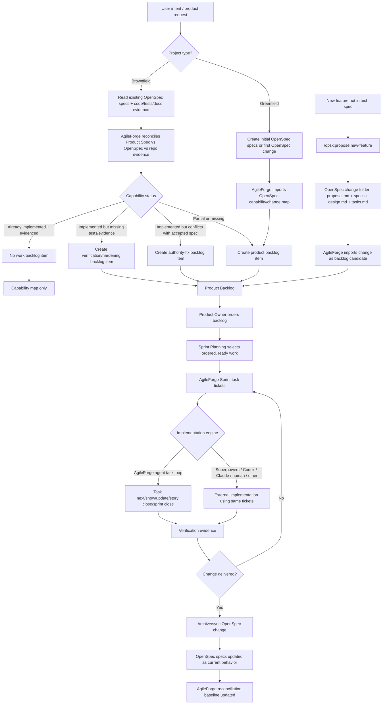

# OpenSpec and AgileForge Workflow Scheme

This scheme captures the working hypothesis for using OpenSpec as the change/spec layer and AgileForge as the planning, reconciliation, and sprint execution layer.

OpenSpec remains fluid and change-oriented. AgileForge should consume OpenSpec artifacts, reconcile them against product authority and repo evidence, produce ordered backlog/sprint work, and feed implementation results back into OpenSpec when delivered.

## Working Rules

- Product authority defines what should be true.
- OpenSpec specs describe current or proposed system behavior.
- Repo evidence includes code, tests, docs, CLI output, and runtime behavior.
- AgileForge should not create a work backlog from the product spec alone for brownfield repositories.
- New feature requests should enter as OpenSpec changes first, then AgileForge can import and reconcile them into backlog candidates.
- `/opsx:apply` is optional because implementation may happen through AgileForge task tickets, Superpowers, Codex, Claude, humans, or another engine.
- OpenSpec archive/sync remains important after delivery because it updates the repo behavior spec.
