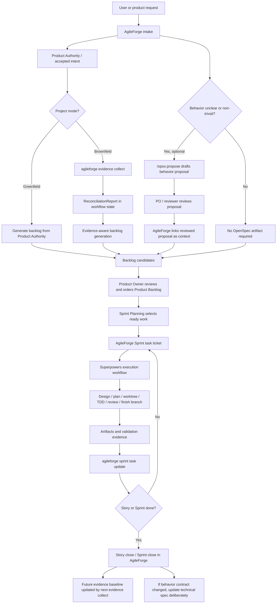

# OpenSpec and AgileForge Workflow Scheme

This scheme captures the current working model for spec-driven Scrum in
AgileForge.

AgileForge remains the Scrum workflow authority. It owns intake, Product
Authority, evidence-aware reconciliation, Product Backlog, Product Owner
ordering, Sprint Planning, Sprint task tickets, evidence, story close, and
sprint close.

Superpowers is the preferred implementation methodology after AgileForge issues
a work ticket.

OpenSpec is optional. In this model, `/opsx:propose` may draft a behavior-change
proposal when a backlog candidate needs a clearer behavior contract. AgileForge
does not use `/opsx:apply` or `/opsx:archive` as workflow gates.

## Working Rules

- Product authority defines what should be true.
- Repo evidence describes what can be observed in the implementation.
- AgileForge must not create a brownfield work backlog from Product Authority
  alone. It should collect evidence first and feed the resulting
  `ReconciliationReport` to backlog generation.
- Greenfield projects do not require evidence collection before the first
  backlog.
- User requests enter AgileForge intake first, not OpenSpec.
- OpenSpec `/opsx:propose` is optional behavior-contract drafting context for
  unclear or non-trivial behavior changes.
- OpenSpec `tasks.md` is not the canonical execution tracker.
- `/opsx:apply` and `/opsx:archive` are not AgileForge workflow gates.
- AgileForge Sprint task tickets are the canonical work tickets.
- Superpowers is the preferred execution workflow after a task ticket exists.
- Delivery evidence returns to AgileForge through task updates, story close, and
  sprint close.
- Technical specs are living behavior contracts. If implementation intentionally
  diverges from the technical spec while still satisfying Product Authority, the
  spec should be updated deliberately rather than drift silently.
